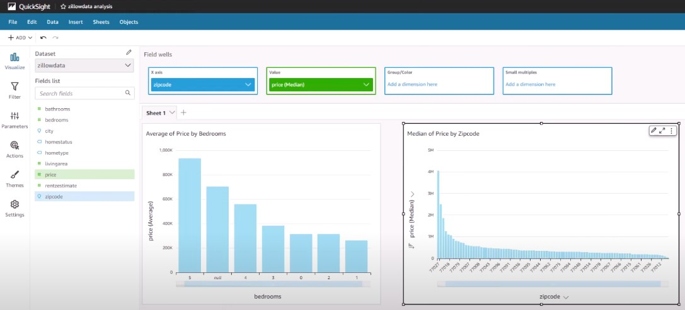

# Projeto de Engenharia de Dados em Python com Zillow Rapid API, AWS e Apache Airflow

## Visão Geral

   Este repositório contém um projeto de engenharia de dados que demonstra como construir e automatizar um processo ETL (Extração, Transformação e Carga) em Python. O projeto extrai dados de propriedades imobiliárias da Zillow Rapid API, carrega-os em um bucket Amazon S3 e, em seguida, aciona uma série de funções AWS Lambda para transformar os dados. Por fim, os dados transformados são convertidos em um formato de arquivo CSV e carregados em outro bucket do Amazon S3 usando o Apache Airflow. O Apache Airflow utiliza um operador S3KeySensor para monitorar se os dados transformados foram carregados em um bucket Amazon S3 antes de tentar carregar os dados em um cluster Amazon Redshift.

   Uma vez que os dados são carregados no Amazon Redshift, o Amazon QuickSight é usado para visualizar os dados da Zillow Rapid API. O Apache Airflow, uma plataforma de código aberto para orquestrar e agendar fluxos de trabalho e pipelines de dados, desempenha um papel crucial neste projeto.

## Ferramentas Utilizadas

- Python
- Zillow Rapid API
- Amazon Web Services (AWS)

1. Amazon S3
2. AWS Lambda
3. Amazon Redshift
4. Amazon QuickSight

- Apache Airflow

## Pipeline de ETL em Python na AWS Cloud

Abaixo está um resumo detalhado do pipeline:

1. **Extração de Dados**:
   - Utilizei Python para se conectar à API Zero Rapid e extrair informações sobre propriedades imobiliárias.

2. **Carregamento de Dados**:
   - Os dados extraídos foram carregados em um bucket Amazon S3, que denominamos "Zona de Aterrissagem". Essa etapa foi crucial para manter a integridade dos dados originais.

3. **Primeira Função Lambda**:
   - **Ativação**: Essa função Lambda foi acionada quando os dados foram adicionados à "Zona de Aterrissagem" no Amazon S3.
   - **Função**: Sua principal responsabilidade foi copiar os dados da "Zona de Aterrissagem" para outro bucket no Amazon S3, onde ocorreriam transformações posteriores.
   - **Justificativa**: Essa etapa foi projetada para garantir a proteção dos dados originais e impedir qualquer modificação na "Zona de Aterrissagem".

4. **Transformação de Dados**:
   - **Ativação**: A segunda função Lambda foi acionada após a cópia dos dados para o segundo bucket no Amazon S3.
   - **Função**: Nesta etapa, a segunda função Lambda realizou transformações nos dados, que poderiam incluir limpeza, formatação ou agregação, preparando-os para análise.
   - **Justificativa**: A separação entre as duas funções Lambda ofereceu modularidade e escalabilidade ao processo de ETL, facilitando a manutenção e adaptação das transformações conforme necessário.

5. **Armazenamento de Dados**:
   - Os dados transformados foram carregados em um cluster Amazon Redshift, onde ficaram disponíveis para armazenamento e análise.

6. **Visualização**:
   - Conectei uma ferramenta de BI, o Amazon QuickSight, ao cluster Redshift, permitindo a criação de visualizações e a obtenção de insights.

7. **Orquestração**:
   - Todo o pipeline foi orquestrado pelo Apache Airflow, que foi executado em uma instância Amazon EC2.

   Este projeto demonstra de forma abrangente o processo de extração, processamento e análise de dados imobiliários usando tecnologias na nuvem, com ênfase nas funções Lambda que garantem a integridade e a eficácia das transformações de dados.

## Dashboard no Amazon QuickSight

   Para tornar os dados mais acessíveis e informativos, criamos um dashboard no Amazon QuickSight. Este painel oferece duas visualizações gráficas principais:

1. Gráfico de Média de Preço por Quantidade de Quartos:

   Neste gráfico, representamos a relação entre a quantidade de quartos em um imóvel e o preço médio. Isso permite que os usuários vejam como os preços variam com base no número de quartos. A visualização ajuda na identificação de padrões, como se imóveis com mais quartos tendem a ser mais caros ou se existem exceções.

2. Gráfico de Mediana de Preço por Código Postal:

   O segundo gráfico apresenta a mediana de preços agrupada por códigos postais. Isso fornece informações sobre como os preços imobiliários variam em diferentes áreas geográficas. A mediana é uma métrica robusta que ajuda a reduzir o impacto de valores atípicos, proporcionando uma visão mais precisa das tendências de preços em cada região.

